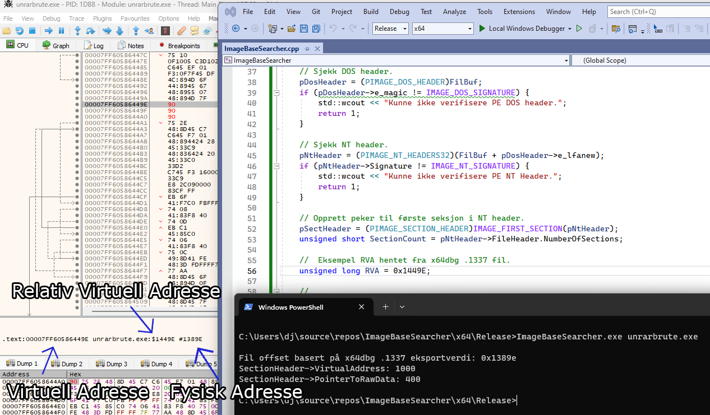

## ImageBaseSearcher

  

Jeg fikk lyst å finne en måte å regne ut offset jeg må ta hensyn til når jeg skriver byte-endringer direkte til exe og dll filer, basert på offsets i eksporterte .1337 patch filer fra x32- og x64dbg.  

Veldig greit hvis jeg vil skrive en universal patcher på et tidspunkt. Koden illustrerer også andre veien hvordan man finner RVA basert på fil-offset.
